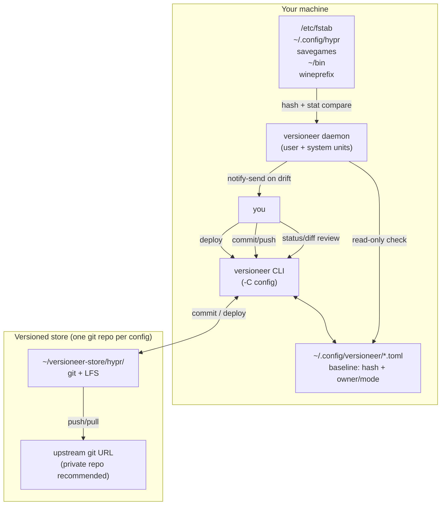
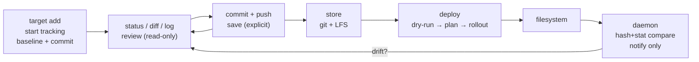
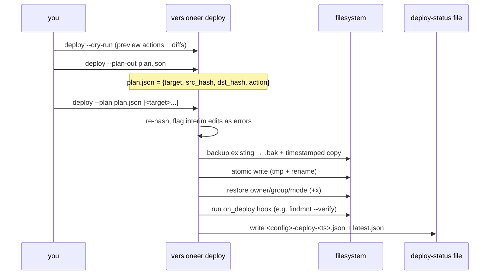
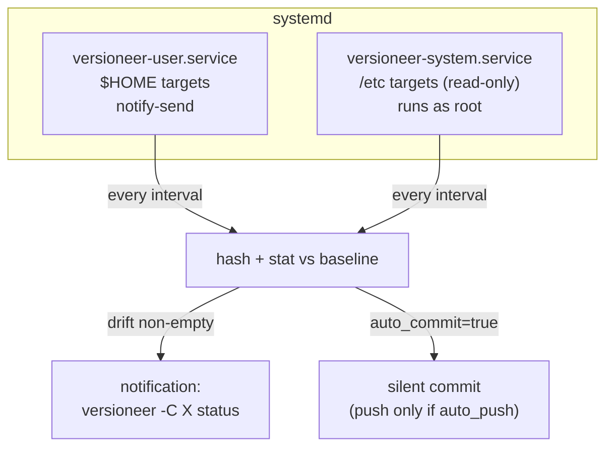

# Versioneer

> Service-based file and config monitoring for Linux — primarily CachyOS / Arch.
> Track what matters, get notified on drift, review explicitly, restore safely on a new machine.

Versioneer is **git + git-lfs with a brain for Linux configs**: it watches files you declare
(`hyprland.conf`, `fstab`, savegames, wine recipes, `~/bin` snippets), tells you when they drift,
and redeploys them safely (backup → atomic write → permission restore → validation hook).

It is **not** a blind backup tool (like `rsync`/`restic`) and **not** a dotfile templater
(like `chezmoi`/`stow`) — it sits in between: versioned state + safe rollout + background monitoring.

> **Project status: v1 implemented (Phases 0–9).**
> `versioneer --help`, `config create/list/show/remove`, `target add/list/remove`,
> `status/diff/log`, `commit/push/pull`, `deploy` (dry-run, plan, rollout,
> backup, atomic write, perm restore), `service install/enable/disable/check`,
> `bootstrap`, `watch`, `manifest`, `doctor` all work from source
> (`pip install -e .`).
> Prerequisites for v1 will be: Arch/CachyOS (or any systemd Linux),
> Python 3.12+, `git`, `git-lfs`, a private git host with SSH auth,
> `notify-send`/D-Bus for notifications (fallback: stdout/journal), optional `sops`+`age`.
> See [§4](#4-installation) for the full checklist.

---

## Table of contents

- [1. High-level picture](#1-high-level-picture)
- [2. Core concepts](#2-core-concepts)
- [3. Core lifecycle](#3-core-lifecycle)
- [4. Installation](#4-installation)
- [5. Quickstart (5 minutes)](#5-quickstart-5-minutes)
- [6. CLI reference](#6-cli-reference)
- [7. Smart deploy in detail](#7-smart-deploy-in-detail)
- [8. Monitor engine + systemd service](#8-monitor-engine--systemd-service)
- [9. Watch-to-add workflow](#9-watch-to-add-workflow)
- [10. Manifests: packages, wine, systemd, env](#10-manifests-packages-wine-systemd-env)
- [11. Secrets, templates, hooks, doctor](#11-secrets-templates-hooks-doctor)
- [12. Use-case recipes](#12-use-case-recipes)
- [13. Config file reference](#13-config-file-reference)
- [14. Storage layout](#14-storage-layout)
- [15. Troubleshooting / FAQ](#15-troubleshooting--faq)
- [16. Uninstall](#16-uninstall)

---

## 1. High-level picture



**Three planes:**

1. **Declared state** — `~/.config/versioneer/<name>.toml` lists targets + last-known `hash/owner/mode`.
2. **Versioned store** — one plain git (+ LFS) repo per config, e.g. `~/versioneer-store/hypr/`.
   Text = normal git, binary/savegames = LFS, manifests = generated recipes.
3. **Live filesystem** — what is actually on disk right now.

The daemon only **compares 1 vs 3** and notifies. Only you (or an explicit
`auto_commit` opt-in for savegames) move data into 2, and only `deploy` moves data from 2 → 3.

---

## 2. Core concepts

> New here? Read this only: a **config** is a named group (e.g. `hypr`) with
> its own git repo. A **target** is one file/dir you track inside it.
> `status` tells you what drifted, `commit+push` saves it, `deploy` restores it.
> Details below are reference — you can start from [§5](#5-quickstart-5-minutes).

### Config = a group of targets with one upstream

```bash
versioneer -C hypr status      # every command takes -C/--config
versioneer -C savegames commit --all -m "after boss fight"
```

Each config has its own TOML, its own store repo, its own upstream, its own
`notify` / `auto_commit` / `check_interval` policy. Typical split:

| Config       | Example targets                          | Notify | Auto-commit |
| ------------ | ---------------------------------------- | ------ | ----------- |
| `hypr`       | `~/.config/hypr/*.conf`                  | yes    | no          |
| `etc`        | `/etc/fstab`, `/etc/firejail/*`          | yes    | no          |
| `savegames`  | `~/.local/share/Steam/.../saves`         | yes    | **yes**     |
| `wine`       | wine manifests + `*.reg`                 | no     | no          |
| `snippets`   | `~/.local/bin/*`                         | no     | yes         |

### Target = one tracked thing

Every target has three independent axes:

| Axis           | Values                                              | Meaning                                                        |
| -------------- | --------------------------------------------------- | -------------------------------------------------------------- |
| **kind**       | `text` `binary` `dir` `manifest`                    | how to store/diff it                                           |
| **flex**       | `fixed` `user` `flexi`                              | where it deploys                                               |
| **interest**   | `state` `diff`                                      | do you care about whole file or what changed                   |

Plus practical fields: `glob`, `ignore`, `symlink`, `machines`, `retention`,
`template`, `on_deploy` (see [§13](#13-config-file-reference)).

- **flex:**
  - `fixed` — absolute path, e.g. `/etc/fstab`. Deploy writes to the same path (needs `sudo`).
  - `user` — auto-detected from `/home/*/`. `/home/alice/.config/hypr/x.conf` deployed by `bob`
    lands in `/home/bob/.config/hypr/x.conf`. A `root` may never be set for these.
  - `flexi` — no fixed destination. You supply `--to <path>` (or get prompted) at deploy time.
- **kind:**
  - `text` — normal git + unified diff. Hypr, firejail, fstab, snippets.
  - `binary` — git-LFS + size warning (`large_file_warn_mb`, default ~10 MB).
    Default retention `count=3`; savegames override to e.g. `{count=30, age="30d"}`.
  - `dir` — snapshot of file list + per-file handling. New files = `untracked` candidates, never auto-added
    (unless `watch --auto-add` for snippets).
  - `manifest` — generated recipe, not a copy (package list, wine recipe — see [§10](#10-manifests-packages-wine-systemd-env)).
- **symlink:** `preserve` (default — recreate the link) vs `follow` (dereference content).

### Drift states (what `status` reports)

| State        | Meaning                                              |
| ------------ | ---------------------------------------------------- |
| `tracked`    | in TOML + baseline committed                         |
| `modified`   | content hash differs from baseline                   |
| `perm-drift` | `owner/group/mode` differs (even if content same)    |
| `missing`    | tracked path no longer exists (incl. dangling links) |
| `untracked`  | new file inside a `dir`/`glob` target, not yet added |
| `read-error` | cannot be read (permission denied) — needs elevation |
| `clean`      | matches baseline                                     |

There is intentionally no `unversioned` catch-all — every state has a distinct next action.

---

## 3. Core lifecycle



Rules (authoritative, from `implementation_plan.md §0`):

1. **`target add` = start tracking from now.** Records `hash/owner/mode`, commits that baseline.
   No history backfill, no watcher installed.
2. **`target remove` = stop tracking.** Deletes TOML entry + `git rm`s artifact, commits removal.
   Working file untouched, git history kept.
3. **Daemon is read-only by default.** `hash + stat` only, never `commit/push`.
   Exception: per-config `auto_commit=true` (savegames/snippets) allows silent commit;
   `auto_push=true` (off by default) additionally pushes.
4. **Save and rollout are always explicit and selective:**
   `commit [--all|<target>...]`, `push/pull`, `deploy [<target>...] [--dry-run]`.
5. **Deploy is safe by construction:** backup-before-overwrite (`.bak`), atomic tmp+rename,
   permission restore (`chown/chmod` incl. `+x`), `sudo` re-exec when needed, per-target
   `ok|skipped|error` (never whole-run abort).

---

## 4. Installation

> `installer/install.sh` is venv-only — it never uses system python for packages.
> Completions stubs live in `installer/completions/` (bash/fish/zsh).
> Rule: never `sudo pip install` / never `pip install --break-system-packages`.
> Use the installer (creates `~/.local/share/versioneer/venv`) or `pipx`.

Arch / CachyOS (recommended):

```bash
sudo pacman -S git git-lfs python-pipx
git lfs install
# optional hardening:
sudo pacman -S sops age

# recommended: venv installer (Phase 0 works)
./installer/install.sh --dev
source ~/.local/share/versioneer/venv/bin/activate
versioneer --help

# alternative: pipx (own venv per app)
pipx install -e .
```

What the installer does:

- installs `versioneer` CLI (via `pipx`/`uv` or system package),
- installs `versioneer-user.service` + `versioneer-system.service` units,
- installs shell completions (bash/fish/zsh — CLI is shell-agnostic),
- checks `git lfs install`, prompts for upstream when you run `config create`,
- `versioneer doctor` re-validates everything.

Requirements: Python 3.12+, `git`, `git-lfs`, `systemd`, `notify-send`/D-Bus (fallback: stdout/journal).

---

## 5. Quickstart (5 minutes)

> Phase 0: step 1 (`config create`) works from source. Steps 2–5 are
> implemented: `target/status/commit/deploy` round-trip works, including
> `.bak` backups, deploy-status files, and plan hash-guards.
> Each step shows the expected output so you can tell success from failure.

```bash
# 1. Create a config (one git repo per config)
versioneer config create --name hypr \
  --path ~/versioneer-store/hypr \
  --upstream git@github.com:me/versioneer-hypr.git
# expected: created ~/.config/versioneer/hypr.toml + git init ~/versioneer-store/hypr

# 2. Track something (baseline + commit happens here)
versioneer -C hypr target add ~/.config/hypr/hyprland.conf
versioneer -C hypr target add ~/.local/bin --kind dir --flex user
# expected: baseline hash/owner/mode recorded, `git log` shows "track <path>"

# 3. Review drift
versioneer -C hypr status
# expected when clean:
# hyprland.conf  clean
# expected when edited:
# hyprland.conf  modified (content differs from baseline)
versioneer -C hypr diff
# expected: unified diff for text, stat summary for binary/dir

# 4. Save
versioneer -C hypr commit -m "tune gaps" --all
versioneer -C hypr push
# expected: TOML baselines updated, drift clears, push ok or
# "offline — push deferred" when upstream unreachable

# 5. Restore on a new machine
versioneer bootstrap git@github.com:me/versioneer-hypr.git
versioneer -C hypr deploy --dry-run
# expected: list of actions + diffs, no writes
versioneer -C hypr deploy
# expected: per-target ok|skipped|error, .bak kept, perms restored
```

Enable background monitoring:

```bash
versioneer service install
versioneer service enable   # user + (optionally) system unit
```

---

## 6. CLI reference

Global flag: every command accepts `-C/--config <name>`.

### Config management

```bash
versioneer config create --name <short> --path <store-path> --upstream <git-url> \
  [--auto-commit] [--auto-push] [--check-interval 5m] [--notify/--no-notify]
versioneer config list
versioneer config show -C hypr
versioneer config remove -C oldname
```

`--auto-commit` / `--auto-push` are off by default. `--auto-push` requires
`--auto-commit`. Used by `savegames`/`snippets` recipes in [§12](#12-use-case-recipes).

### Tracking set

```bash
# single file, auto-detect kind/flex
versioneer -C hypr target add ~/.config/hypr/hyprland.conf

# explicit: fstab is fixed + text
versioneer -C etc target add /etc/fstab --root /etc --kind text --flex fixed

# snippets via glob + ignore + template lint
versioneer -C snippets target add ~/.local/bin \
  --kind dir --flex user --glob '~/.local/bin/*' \
  --ignore '__pycache__/' --template

# savegame dir with excludes + longer retention
# --retention COUNT is shorthand for --retention-count COUNT.
# Full form: --retention-count 30 --retention-age 30d
versioneer -C savegames target add ~/.local/share/Steam/.../saves \
  --kind dir --flex user \
  --ignore 'Cache/' --ignore '*.log' \
  --retention-count 30 --retention-age 30d

# list / stop tracking (keeps file on disk + git history)
versioneer -C hypr target list
versioneer -C hypr target remove ~/.config/hypr/old.conf
```

`add` also runs two lints (warn-only): **secret scan** (possible token/key → suggest
`encrypt=true` or `ignore`) and **hardcoded-path lint** (absolute `/home/<other>/`
inside a `text` file → suggest `--template`).

### Review (read-only) & save (explicit)

```bash
versioneer -C hypr status            # modified|perm-drift|missing|untracked|read-error|clean
versioneer -C hypr diff              # unified diff (text), stat summary (binary/dir), recipe preview (manifest)
versioneer -C hypr diff <target>
versioneer -C hypr log               # git log for the store
versioneer -C hypr log <target>

versioneer -C hypr commit -m "msg" <target>...
versioneer -C savegames commit --all -m "post-session"   # bulk savegame style
versioneer -C hypr push
versioneer -C hypr pull              # offline-safe: status/commit work offline, push/pull defer with message
```

Locked savegames (SQLite WAL, game still running) are copied-then-hashed with a warning,
never hashed in place.

### Service

```bash
versioneer service install
versioneer service enable
versioneer service disable
# inspect with systemd directly:
# systemctl --user status versioneer-user.service
# sudo systemctl status versioneer-system.service
```

### Deploy (selective, safe; full semantics in §7)

```bash
versioneer -C hypr deploy --dry-run
versioneer -C hypr deploy --plan-out plan.json
versioneer -C hypr deploy --plan plan.json [<target>...]
versioneer -C hypr deploy [<target>...] [--to <path>] [--yes|--no-interaction]
  [--force-host] [--prune] [--apply]
# --to: required for flexi targets, preview path for fixed/user
# --force-host: override machines allowlist (testing only)
# --prune: allow dir merge to delete extras (default: never deletes)
# --apply: allow manifest replay to write (packages); default prints only
```

### Bootstrap (new machine)

```bash
# single config from URL (--to overrides default store path):
versioneer bootstrap <upstream-git-url> [--to DIR] [--host HOST]
# all configs already declared in ~/.config/versioneer/:
versioneer bootstrap --all [--host HOST]
# = clone store(s) + recreate TOML(s) + deploy --all
# recommended: deploy --dry-run first
```

### Manifests & doctor

```bash
# flags combine; at least one required. Regenerated on commit, replayed on deploy.
versioneer -C base manifest [--packages] [--wine] [--systemd] [--env]
versioneer doctor            # all configs, exit != 0 on errors
versioneer doctor -C etc     # single config
versioneer doctor --secrets  # secret audit only (token/key scan)
```

---

## 7. Smart deploy in detail



Usage:

```bash
versioneer -C hypr deploy --dry-run
versioneer -C hypr deploy --plan-out plan.json
versioneer -C hypr deploy --plan plan.json
versioneer -C hypr deploy <target>... --yes        # selective restore, e.g. one save
versioneer -C etc deploy --to /tmp/preview --dry-run  # flexi preview
```

Per-category behavior:

- **text/binary:** backup → atomic write → perm restore → `sudo` re-exec if unwritable.
  Exists + differs → prompt overwrite (default N; `--yes/--no-interaction` for scripts).
- **dir:** `skip` (default) | `overwrite` | `merge` (rsync-like, no deletes unless `--prune`).
- **symlink:** `preserve` recreates link, `follow` writes content.
- **template:** substitutes `{{HOME}}`/`{{HOST}}` when `template=true`.
- **flexi:** requires `--to <path>` or interactive prompt; missing `--to` fails that entry only.
- **manifest:** prints replay (`pacman -S ...`, `setup-wine.sh`); `--apply` where safe.
- **machines:** `machines=["laptop"]` targets deploy as `skipped (wrong host)` elsewhere
  (`--force-host` overrides for testing).
- **missing destination:** recorded as per-target `error`, never whole-run failure.

Status file: `~/.local/state/versioneer/<config>-deploy-<timestamp>.json` + `latest.json`
symlink. Next deploy reads the previous status as baseline. `on_deploy` hook output
(e.g. `hyprctl reload`, `findmnt --verify /etc/fstab`) is captured there.

> Deploying `/etc/fstab`? Always `--dry-run` first, keep the `.bak`, and keep a live USB handy.
> Versioneer helps you not shoot your foot — it can't remove the gun.

---

## 8. Monitor engine + systemd service



- Checks on system start + every interval (global default `3h`, overridable per config/target:
  `check_interval = "5m"`, `"10s"` for tests, `"inotify"` for immediate savegame/snippet mode via `watchdog`).
- Per-config `notify = true|false` — noisy savegame configs can commit silently and notify on errors only (damping: max one notification per interval).
- System unit only **reads** fixed targets. Unreadable files → `read-error`
  ("run `versioneer status` as root"), never a push warning.
- Zero git writes by default (asserted in tests); writes happen only with `auto_commit=true`.
- Game-exit hook pattern (shipped as unit template):

  ```bash
  versioneer commit -C savegames --all -m "post-session" && versioneer push -C savegames
  ```

Tune with `VERSIONEER_INTERVAL` env var in tests (`10s` instead of `3h`).

---

## 9. Watch-to-add workflow

Don't know which files a game / tool touched? Capture them:

```bash
versioneer -C savegames watch ~/Games/mygame --auto-add
# 1. snapshot hashes
# 2. ... play / change settings / Ctrl-C ...
# 3. diff → interactive multi-select → target add (or auto-add all)
```

Uses `inotify` (`watchdog`) with polling fallback. Respects `ignore`, applies the same `root`.

---

## 10. Manifests: packages, wine, systemd, env

Manifests answer *"how do I rebuild this machine without re-cooking everything?"* without
storing gigabytes in git.

```bash
versioneer -C base manifest --packages --wine --systemd --env
versioneer -C base commit -m "refresh manifests" && versioneer -C base push
# on new machine:
versioneer -C base deploy   # prints replay instructions, --apply where safe
```

| Type       | Captures                                                              | Artifact              |
| ---------- | --------------------------------------------------------------------- | --------------------- |
| `packages` | `pacman -Qqe`, AUR (`yay/paru -Qqm`), `flatpak list --app`            | `packages.list` + `setup-packages.sh` |
| `wine`     | `wine --version`, `WINEARCH`, `WINEPREFIX`, `winetricks list-installed`, exe inventory | `wine-manifest.json` + `setup-wine.sh` |
| `systemd`  | enabled user + system units                                           | `units.list`          |
| `env`      | `$PATH`, shell, hotkey env                                            | `env.json`            |

Manifest targets diff like text (regenerated on `commit`) and replay on `deploy`.

**Wine rule: manifest-only by default.** Never `target add ~/prefix` whole — prefixes are GBs
of churn (`Temp/`, `*.log`, `dosdevices/` symlinks). Instead:

1. one `manifest(type=wine)` for the recipe,
2. selective `text` targets for `*.reg` / `*.cfg` with default ignores:

   ```toml
   ignore = ["drive_c/users/*/Temp/**", "*.log", "*.tmp", "**/Cache/**", "dosdevices/**"]
   ```

3. savegames inside a prefix as a separate `binary` target. Full-prefix copy requires explicit
   `--force` + docs acknowledgment.

---

## 11. Secrets, templates, hooks, doctor

**Secrets** — `add`/`commit` scans for tokens/private keys (warn-only in v1, never blocks).
For real secrets: `encrypt = true` per target via `sops + age` (encrypted in store, decrypted on deploy).
Keep upstreams private; `doctor --secrets` audits.

**Templates** — `template = true` substitutes `{{HOME}}` / `{{HOST}}` on deploy.
Lint warns when a tracked text file contains a hardcoded `/home/<someone>/`.

**Hooks** — `on_deploy = "findmnt --verify /etc/fstab"` or `"hyprctl reload"` runs after copy;
failure = per-target `error` with output captured in the deploy-status file.

**Doctor** — one health command for everything else:

```bash
versioneer doctor
# checks: git-lfs present, upstream reachable/auth, disk quota,
# read-errors, large files vs large_file_warn_mb, dangling symlinks,
# missing validators, retention status. Exit != 0 on errors.
```

---

## 12. Use-case recipes

### A. Hyprland / firejail configs (new machine without reinventing)

```bash
versioneer config create --name hypr --path ~/versioneer-store/hypr --upstream <url>
versioneer -C hypr target add ~/.config/hypr --kind dir --flex user
versioneer -C hypr target add ~/.config/firejail --kind dir --flex user
versioneer -C hypr commit --all -m "hypr baseline" && versioneer -C hypr push
# new machine:
versioneer bootstrap <url> && versioneer -C hypr deploy --dry-run && versioneer -C hypr deploy
# add on_deploy = "hyprctl reload" to hot-reload after deploy
```

### B. `/etc/fstab` (backup + safe restore)

```bash
versioneer config create --name etc --path ~/versioneer-store/etc --upstream <url>
versioneer -C etc target add /etc/fstab --root /etc --kind text --flex fixed
versioneer -C etc commit --all -m "fstab" && versioneer -C etc push
# restore: always dry-run, check .bak, run findmnt --verify hook
```

### C. Savegames (bulk, frequent, large)

```bash
versioneer config create --name savegames --path ~/versioneer-store/saves \
  --upstream <url> --auto-commit --check-interval 5m
versioneer -C savegames target add ~/.local/share/Steam/... --kind dir \
  --ignore 'Cache/' --ignore '*.log' --retention-count 30 --retention-age 30d
versioneer -C savegames commit --all -m "checkpoint"
# single-file restore:
versioneer -C savegames deploy "saves/slot1.sav"
```

### D. Wine (know what's installed, no re-cooking)

```bash
versioneer config create --name wine --path ~/versioneer-store/wine --upstream <url>
versioneer -C wine manifest --wine
versioneer -C wine target add ~/prefixes/mygame/system.reg --kind text --flex user
versioneer -C wine commit --all -m "wine recipe" && versioneer -C wine push
# new machine: deploy prints setup-wine.sh (winetricks verbs + env)
```

### E. CLI snippets (`~/bin` hotkey scripts)

```bash
versioneer config create --name snippets --path ~/versioneer-store/snippets \
  --upstream <url> --auto-commit
versioneer -C snippets target add ~/.local/bin --glob '~/.local/bin/*' --template
versioneer -C snippets watch ~/.local/bin --auto-add
# +x is preserved via mode restore on deploy
```

---

## 13. Config file reference

`~/.config/versioneer/<name>.toml` (annotated):

```toml
[meta]
name = "hypr"
upstream = "git@github.com:me/versioneer-hypr.git"
root = "/etc"                    # optional; omit for user targets (never set root with flex=user)
storage = "~/versioneer-store/hypr"
notify = true
auto_commit = false              # true only for savegames/snippets
auto_push = false                # requires auto_commit=true
check_interval = "3h"            # "5m", "10s" (tests), "inotify"
encrypt = false
large_file_warn_mb = 10          # warn when binary target exceeds this

[[targets]]
path = "hyprland.conf"           # relative to root if root set, else absolute
# --- auto-managed by target add / commit. Do not hand-edit: ---
# abs_path = "/home/alice/.config/hypr/hyprland.conf"  # resolved cache
# owner = "alice"                # captured on add, refreshed on commit
# group = "alice"
# mode = "0644"                  # incl. +x for snippets, restored on deploy
# hash = "sha256:..."            # baseline; drift = status, save = commit
kind = "text"                    # text|binary|dir|manifest
glob = ""                        # e.g. "~/.local/bin/*"
ignore = []                      # e.g. ["*.log", "Cache/"]
symlink = "preserve"             # preserve|follow
flex = "user"                    # fixed|user|flexi
interest = "state"               # state|diff (v1: diff previews diff, deploys state)
deploy_path = ""                 # required for flexi (--to at deploy)
machines = []                    # [] = all hosts, else ["laptop"]
check_interval = ""              # per-target override, else meta value
retention = { count = 3 }        # e.g. {count=30, age="30d"} for saves
template = false                 # {{HOME}}/{{HOST}} substitution on deploy
on_deploy = ""                   # e.g. "hyprctl reload"

[targets.manifest]               # only when kind="manifest"
type = "wine"                    # packages|wine|systemd|env
source = "builtin:wine"
output = "wine-manifest.json"
```

---

## 14. Storage layout

```text
~/.config/versioneer/<name>.toml        # declared state + baselines
~/versioneer-store/<name>/              # git + LFS repo (one per config)
~/.local/state/versioneer/
  <config>-deploy-<timestamp>.json      # per-target ok|skipped|error + hook output
  <config>-latest.json -> <config>-deploy-<timestamp>.json  # symlink to newest
  backups/<timestamp>/...               # backup-before-overwrite copies (.bak)
```

- `text` → normal git objects, word diff.
- `binary` → LFS (`*.bin` + explicit binary targets), `large_file_warn_mb` alert,
  `retention = {count, age}` enforced on commit (Q3 decision: configurable, not silent squash).
- `target remove` = `git rm` + commit; history kept (full purge via `git filter-repo` documented).

---

## 15. Troubleshooting / FAQ

### Daemon debugging (when notifications don't arrive)

```bash
systemctl --user status versioneer-user.service
journalctl --user -u versioneer-user.service --since "2 hours ago"
sudo systemctl status versioneer-system.service
versioneer doctor -C hypr   # config-level health
NOTIFY_DEBUG=1 versioneer -C hypr status  # stdout fallback when D-Bus missing
```

Logs: `journalctl` (service) + `~/.local/state/versioneer/<config>-deploy-*.json` (deploy).
Uninstalled/broken service → `status` still works manually; only background checks stop.

| Symptom | Fix |
| ------- | --- |
| `read-error` on `/etc/*` | run `sudo versioneer -C etc status`; system unit only reads, never writes |
| daemon spams savegame notifs | set `check_interval="5m"` + `auto_commit=true`, add `ignore` for `Cache/*.log` |
| binary > 10 MB warning | expected for saves/prefixes; confirm LFS, or split target / use manifest |
| `flexi` deploy fails | pass `--to <path>` or set `deploy_path`; entry fails alone, run continues |
| destination missing | recorded as `error` in deploy-status; create parent dir or `--to` elsewhere |
| interim edit between plan and deploy | re-hash flags it as deployment error — re-run `--plan-out` |
| hardcoded `/home/alice` after restore | enable `template=true`, use `{{HOME}}` |
| laptop vs desktop diverge | `machines=["laptop"]` + `{{HOST}}`, or per-machine branches (merge cost documented) |
| `doctor` red | follow its list: `git-lfs`, upstream auth, disk, dangling symlinks, validators |
| pushed a secret | rotate it now — git history keeps it; then enable `encrypt=true` (`sops/age`) |

| `command not found: versioneer` | expected until Phase 0–1 lands; see status banner at top |
| `installer/install.sh` missing | expected — not yet packaged; track Phase 6 |

**Design choices worth knowing:** `diff`-interest deploys state in v1 (true patch-apply is v2);
dir `merge` never deletes extras unless `--prune`; daemon never auto-pushes unless you opt in.

---

## 16. Uninstall

> Not yet implemented.

```bash
versioneer service disable
./installer/uninstall.sh   # or: versioneer uninstall
# stops units, removes CLI + ~/.config/versioneer (after confirm)
# stores in ~/versioneer-store/<name> are kept unless --purge-stores is passed
```

---

*Spec: `initial_design.md` (goals) → `implementation_plan.md` (phases M1–M6, Phases 0–9).*
*This README is the user-facing view of that plan — start with [§5](#5-quickstart-5-minutes),
then jump to your recipe in [§12](#12-use-case-recipes).*
